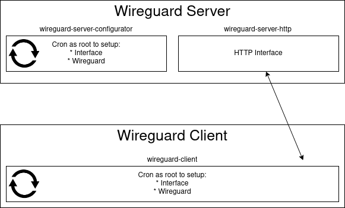

* wg -> Package to config Device and Wireguard
* wireguard-server-configurator -> Cron runs on the Wireguard Server
* wireguard-server-http -> HTTP Interface runs on the Wireguard Server
* wireguard-client -> Client run as Cron on the Client which should connect to the Server